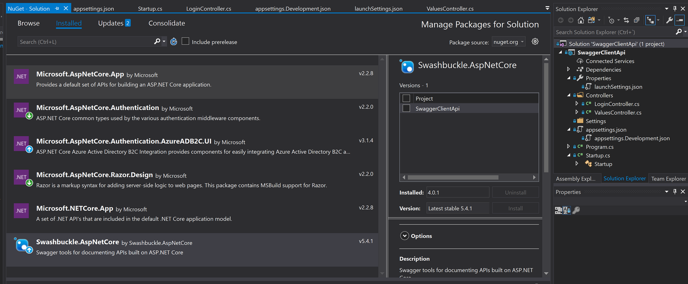
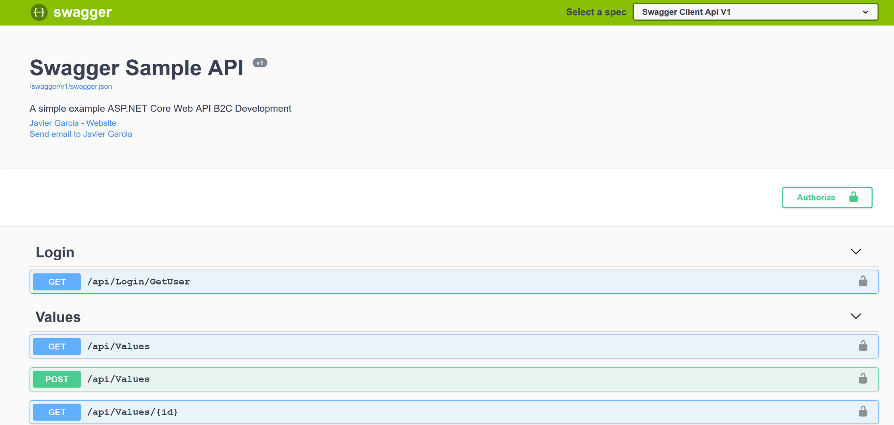

# Readme.md

### Dot Net Core Api integrating Swagger and Azure B2C Authentication 

- Dot Net Core Framework 2.2
- Azure B2C Authentication configuration.
- Setup nuget package (Swashbuckle.AspNetCore) Swagger v. 4.0.1 and integrates the authorization in the Web Api


> Nuget Packages version

This repository contains the way of configuring Swagger and Azure B2C Authentication together. 

We need an application (client Id) for your Api and one more for Swagger of specific Azure Domain  (***.onmicrosoft.com**) applies to a "Sign In" policy (**B2C_1_SignInV2**)  and the Api application has to have a scope configured.

Use this link for more information how to configure a swagger app in Azure:
https://docs.microsoft.com/es-es/archive/blogs/isgupt/swagger-authentication-against-azure-ad-b2c 

https://docs.microsoft.com/es-es/archive/blogs/pratushb/enable-swagger-to-authenticate-against-azure-ad

> Inside AddSwaggerGen():

```javascript
 c.AddSecurityDefinition("oauth2", new OAuth2Scheme()
                {
                    Description = "Client credentials needed.",
                    Type = "oauth2",
                    Flow = "implicit",
                    AuthorizationUrl = "https://{your_domain.onmicrosoft.com}/oauth2/v2.0/authorize"

                c.AddSecurityRequirement(new Dictionary<string, IEnumerable<string>>
                {
                    {"oauth2", new string[] { }}
                });
```


> Inside UserSwaggerUI():

```javascript
            app.UseSwaggerUI(c =>
            {
                c.OAuthClientId("{Your_Swagger_Client_Id}");
                c.OAuthAppName("Sample API B2C");
                c.OAuthAdditionalQueryStringParams(new Dictionary<string, string>() {
                    { "resource", "http://localhost:5050/" },
                    { "p", "B2C_1_SignInV2" },
                    { "scope", "https://{your_domain}.onmicrosoft.com/{your_api_app}/access.read" }
                });
                c.SwaggerEndpoint($"{basePath}swagger/v1/swagger.json", "Swagger Client Api V1 ");
            });
```



> Swagger Home Page
